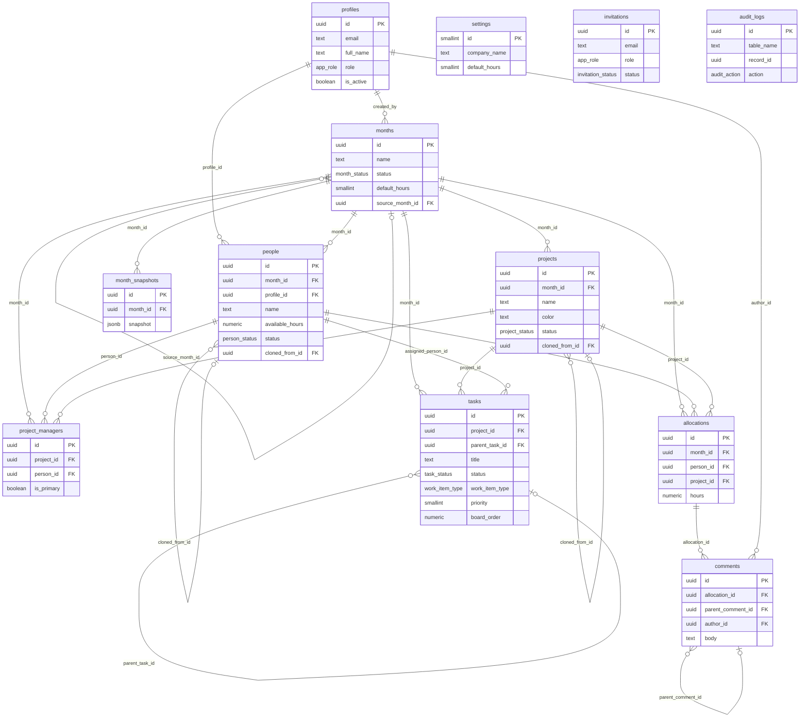

# Arquitectura

## Decisión clave: personas y proyectos están "scoped" por mes

`people` y `projects` no son catálogos globales — cada fila lleva `month_id`
y pertenece a un único mes. Crear un mes nuevo (`create_month_from_previous`)
**duplica** las filas del mes de origen con IDs nuevos (`cloned_from_id`
guarda el linaje), en vez de reutilizar las mismas filas. Esto es lo que el
spec pide literalmente ("crear un mes nuevo copia... personas, proyectos,
distribución") y además preserva el historial: editar personas de julio
nunca toca las de marzo.

## Modelo de datos (ERD)



`audit_logs.record_id` **no** es una foreign key a propósito — el historial
debe sobrevivir al borrado de la fila original.

## Roles y RLS

La seguridad real vive en las políticas de `supabase/migrations/`, no en el
frontend. El frontend (`RoleRoute`, chequeos de `lib/roles.ts`) solo oculta
acciones que el backend rechazaría de todos modos.

Funciones `security definer` usadas por las políticas:

| Función | Qué verifica |
|---|---|
| `is_admin()` | `profiles.role = 'administrador'` del usuario actual |
| `is_gestor_or_admin()` | rol `administrador` o `gestor` |
| `is_month_locked(month_id)` | el mes no está `abierto` |
| `can_write_month(month_id)` | admin siempre; gestor solo si el mes sigue abierto |
| `is_analista_tecnologia()` | rol `analista_tecnologia` — eje de **lectura** (quién tiene la vista recortada) |
| `is_analista_role()` | rol `analista` o `analista_tecnologia` — eje de **escritura** (quién trabaja solo sobre lo suyo) |
| `is_own_person(person_id)` | la fila del roster tiene `profile_id = auth.uid()` (false si es null) |
| `is_own_allocation(allocation_id)` | la celda es de la persona vinculada al usuario actual |
| `can_write_own_work(month_id, person_id)` | cualquiera de los dos analistas + mes abierto + la fila es suya |

El rol **Analista de Tecnología** introduce un segundo eje en RLS: los tres
roles originales se distinguen por *cuánto* pueden escribir sobre todo el
mes; este se distingue por *sobre qué filas* puede leer y escribir. El
puente que lo hace expresable es `people.profile_id` — sin él no hay forma
de relacionar una cuenta (`profiles`) con las filas del roster de un mes
(`people`), que es a quien se asignan tareas y horas.

| Tabla | Lectura | Escritura |
|---|---|---|
| `profiles` | cualquier autenticado | propio perfil (columnas no privilegiadas) o admin; `role`/`is_active` solo admin (trigger `guard_profile_privileged_columns`) |
| `months` | cualquier autenticado | **solo admin** — crear, editar, duplicar (`create_month_from_previous`), cambiar de estado (trigger `guard_month_status_transition`) y eliminar. El gestor sigue escribiendo *dentro* de un mes abierto vía `can_write_month()`, pero no administra el mes |
| `month_snapshots` | solo admin | crear/restaurar vía RPC, solo admin |
| `project_managers` | cualquier autenticado | `can_write_month()` — admin siempre, gestor solo si el mes está abierto |
| `projects` | cualquier autenticado | crear: `can_write_month()` o cualquier analista con el mes abierto (válvula de escape del diálogo de tarea); editar/eliminar: solo `can_write_month()` |
| `people` | cualquier autenticado; analista de tecnología solo su propia fila | `can_write_month()` |
| `tasks` | admin: todo · gestor: las de los proyectos que gerencia, más las suyas (creadas o asignadas) · analista: solo asignadas a él o creadas por él, y solo con el mes liberado | `can_write_month()` o `can_write_own_work()`; el `with check` le impide asignarle la tarea a otra persona. Entregar y devolver van por RPC (`submit_task_for_review` / `return_task_for_rework`): el trigger `task_review_flow` rechaza el cambio de estado directo cuando falta el reporte de horas o el motivo. **Borrar**: admin cualquiera; el resto lo que creó; el gestor además lo de los proyectos que gerencia |
| `allocations` | cualquier autenticado; analista de tecnología solo las suyas | `can_write_month()` |
| `activities` | cualquier autenticado; analista de tecnología solo las de sus celdas | `can_write_month()`, o analista de tecnología sobre sus celdas con el mes abierto |
| `allocations` (excepción) | — | insertar con `hours = 0` permitido a cualquiera, para anclar un comentario a una celda vacía o registrar tiempo en ella, sin poder asignar horas reales |
| `comments` | cualquier autenticado; analista de tecnología solo las de sus celdas | insertar: cualquiera (autor = self); editar/borrar: autor o admin |
| `settings`, `invitations` | `settings`: cualquiera / `invitations`: solo admin | solo admin |
| `audit_logs`, `month_snapshots` | admin (`month_snapshots`: gestor+admin) | ninguna política de insert — solo escriben los triggers/RPC `security definer`, que corren como dueño de la tabla y no pasan por RLS |

## RPCs (`security definer`)

- **`create_month_from_previous(source_month_id, new_name)`** — todo en una
  función en vez de varios inserts desde el cliente, porque hay que
  remapear IDs entre 4+ tablas de forma atómica (tablas temporales
  `_people_map`/`_project_map`). Copia personas/proyectos/gerentes/tareas;
  **no** copia comentarios ni auditoría del mes anterior.
- **`create_month_snapshot`** / **`restore_month_snapshot`** — checkpoint
  jsonb de personas/proyectos/gerentes/asignaciones. Restaurar borra y
  reinserta con los mismos IDs (para que comentarios existentes se
  reconecten), lo que implica que las tareas creadas después del snapshot
  se pierden al restaurar (no forman parte del snapshot).

## Auditoría

`audit_row_change()` es un trigger genérico (`security definer`) sobre
`months`, `people`, `projects`, `project_managers`, `tasks` y `allocations`:
en `UPDATE` compara cada columna del `jsonb` viejo vs. nuevo y escribe una
fila por campo que cambió; en `INSERT`/`DELETE` escribe una fila con el
estado completo.

## Frontend

```
src/
  routes/          ProtectedRoute, RoleRoute, router.tsx
  app/providers.tsx  QueryClientProvider, TooltipProvider, Toaster
  components/ui/    primitivas shadcn
  components/shared/ AppShell, MonthSwitcher, ConfirmDialog, NoActiveMonth
  stores/           sessionStore (sesión/perfil), activeMonthStore (mes activo, persistido)
  features/<módulo>/
    api/      llamadas a Supabase
    hooks/    TanStack Query (queries + mutations optimistas)
    components/
    pages/
```

El **mes activo** vive en `activeMonthStore` (zustand + `persist` en
localStorage), no en la URL — Distribución/Proyectos/Personas/Reportes
operan sobre él, con un selector (`MonthSwitcher`) disponible en todo
momento en el header, igual que el workspace activo de una herramienta tipo
Notion/Airtable.

### Grilla (react-data-grid)

Las filas de `DistribucionPage` se derivan directamente del cache de
TanStack Query (`buildGridRows(people, allocations)`), no de un estado
local paralelo: al confirmar una celda (`onRowsChange`), la mutación
optimista actualiza el cache y la grilla recalcula Total/Diferencia/color
de estado en el siguiente render. Copiar/pegar multi-celda (bloques TSV
desde Excel) se maneja con un handler propio en vez del `onCellPaste` de
una sola celda que trae la librería por defecto.

### Tablero de tareas

`board_order` es `numeric`, no un entero de posición: soltar una tarjeta
entre otras dos calcula el punto medio de sus órdenes, así que reordenar es
un solo UPDATE en vez de reescribir toda la columna. El arrastre usa la API
nativa de HTML5 en vez de una librería de DnD (el módulo solo mueve tarjetas
entre cinco columnas, no justifica el peso). `started_at`/`completed_at` los
sella el trigger `tasks_track_status_timestamps` en el servidor, para que el
dato sea el mismo se cambie el estado desde el tablero, el backlog o el
detalle. Ver [`DOCUMENTACION.md`](DOCUMENTACION.md#6-módulo-tareas).

### Cronograma

No tiene tablas propias: el Gantt lee `tasks` (`start_date`/`due_date`) y el
calendario de horas lee `activities`. El eje temporal se **deriva de los
datos** porque `months` guarda un nombre de texto y nunca tuvo rango de
fechas; sin datos con fecha, cae al mes natural en curso. Registrar tiempo
desde el calendario escribe en `activities`, así que el trigger
`sync_allocation_hours_from_activities` lo refleja en `allocations.hours`:
el auto-reporte de un analista sí mueve la distribución oficial del mes.
Ver [`DOCUMENTACION.md`](DOCUMENTACION.md#7-módulo-cronograma).

### Tema

Esta app comparte sistema de diseño con **Experia** (la otra plataforma de
CEINFES). La referencia completa está en
[`Experia-Design-System.md`](../Experia-Design-System.md) en la raíz del
repo, y `src/index.css` implementa sus tokens con los nombres que consume
shadcn: naranja `#EC671A` como primario, morado `#5E4F9C` como acento,
superficies `#F9FAFB`/`#FFFFFF` en claro y `#15141D`/`#1C1B28` en oscuro,
radios 8–24 px, sombras de dos capas con tinte `#1A1A2E`, paleta de gráficas
`--viz-1..8` y anillo de foco naranja de doble contorno.

Dos reglas del sistema que hay que respetar al escribir componentes:

1. **Ningún hex en un componente.** Todo color que cambie con el tema va como
   `var(--token)`; es lo que hace que el modo oscuro funcione sin tocar los
   componentes.
2. **Acentos planos.** Las variables `--gradient-*` existen por compatibilidad
   pero resuelven a color sólido, igual que en Experia. Si algún día se
   quieren degradados, se cambian ahí y los toma toda la app.

Los colores de estado (`success`/`warning`/`danger`) son un set semántico
aparte de los tonos de marca y no deben mezclarse. El tema claro/oscuro se
marca en `<html>` con la clase `.dark` **y** el atributo `data-theme`, y se
aplica antes del primer paint con el script de `index.html`. La grilla mapea
sus propias variables `--rdg-*` a las mismas variables de tema en vez de
usar las clases `.rdg-light`/`.rdg-dark` del paquete.
